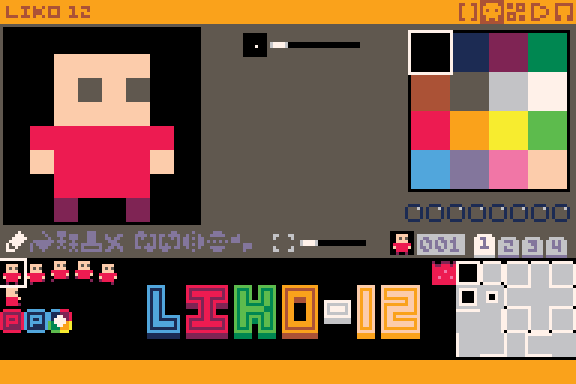
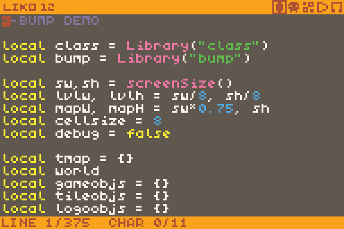
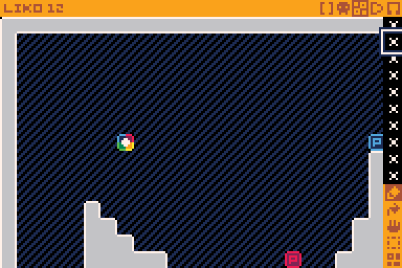
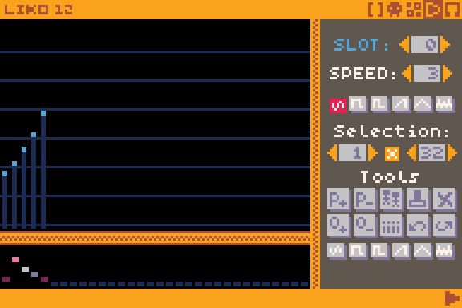

# Installing LIKO-12

If you haven't done it yet, you should install LIKO-12 on your machine by
following the [installation guide](installation.md). Once you have LIKO-12 up
and running on your machine, you can go to the next step.

# Running and editing the demos

## Running a game

A good entry point to learning to use LIKO-12 is looking at the code of the
demos that come bundled with LIKO-12.

The demos need to be installed with the following command:

```bash
install_demos
```

The demos will be installed in `D:/Demos`. Go in this directory:

```bash
cd Demos
```

You can see the list of installed demos by using the `dir` command (or its
alias, `ls`). You should see a bunch of `.lk12` files. Each of those files is a
LIKO-12 game.

Go ahead and try playing one of them. Use the `load` command first to load a
game into memory. For example:

```bash
load bump.lk12

# Note that you can omit the .lk12 extension, so the following works too:
load bump
```

Once this is done, you can type `run` to launch the game. You can then press
the Escape key to quit the game. Try it out!

## Editing a game

Once you have quitted the game, it is still loaded in memory, so you can edit
it. To do that, press the Escape key again to switch from the terminal to the
editors.

You should see the sprite editor:



The sprite editor, as its name suggest, is where you can edit the sprites of
your game.

LIKO-12 features several editors. We will cover their basic use in another
guide. For now, let's just review which ones are available right now.

To switch between the different editors, you can click on the icons in the
top-right corner or press Alt and Left (or Right) simultaneously.



This is the code editor, where you can write the code of your game.



This is the map editor, where you can create the levels of your game.



This is the SFX editor, where you can create some sound effects for your game.

You can switch back to the terminal by pressing the Escape key again.

# What's next

LIKO-12 games are coded in Lua 5.1, so it's probably a good idea to learn it.
A [tutorial](https://www.lua.org/pil/contents.html) is available on Lua website
(note that it is a tutorial for Lua 5.0, but it should not matter much). 

You can also type `programs` in the terminal to get a list of available
available commands. You can get help for a specific command by typing
`<command> -?` (for example, `export -?`).

More guides are being worked on.
